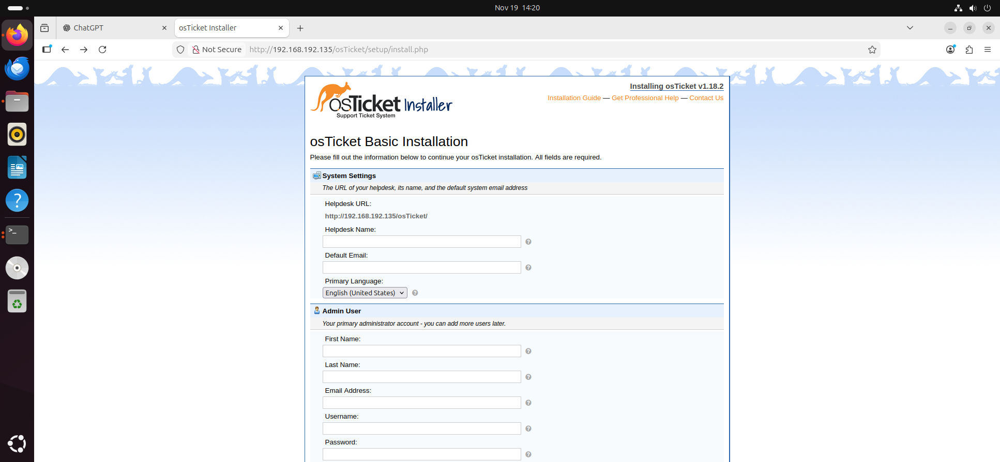
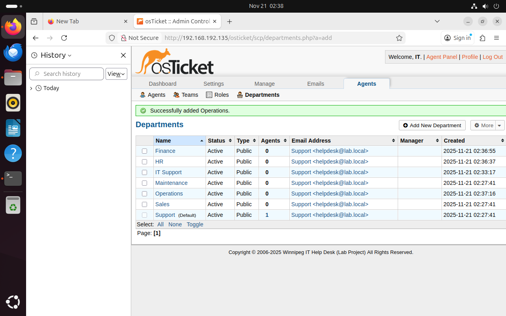
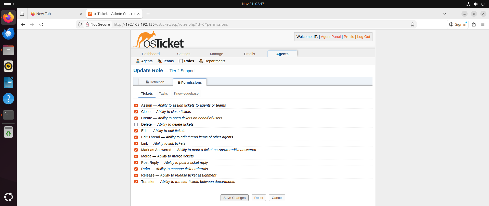
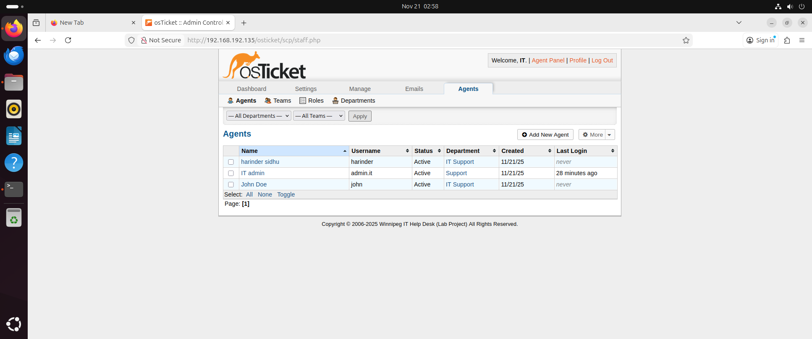
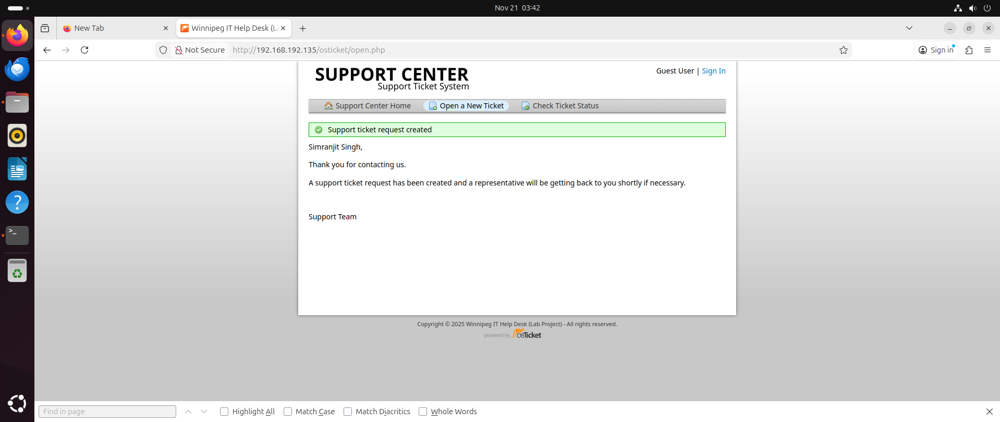
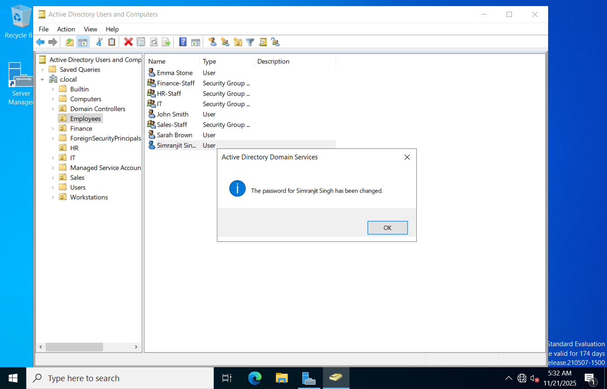
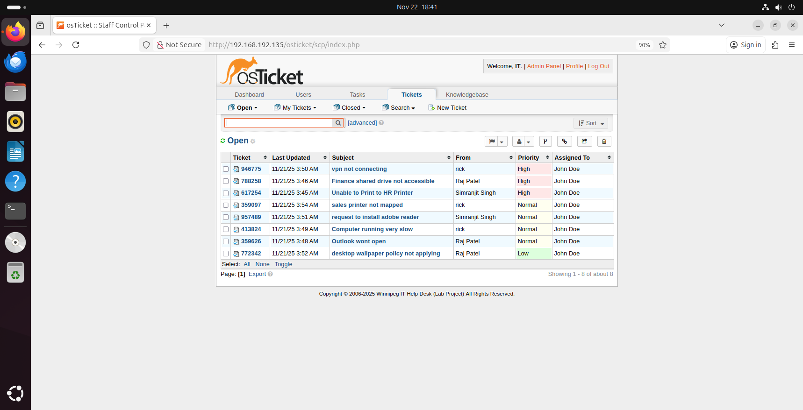
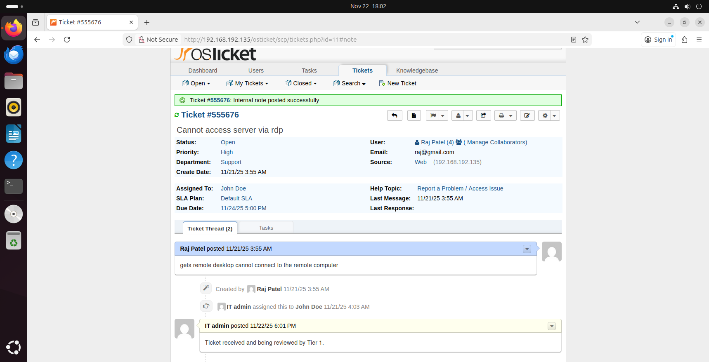
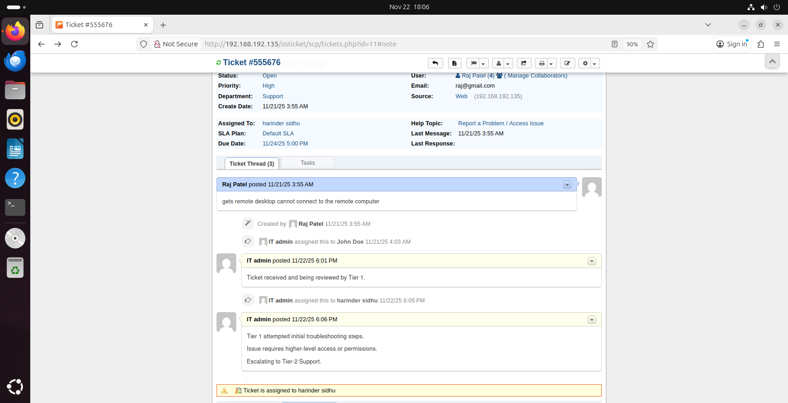
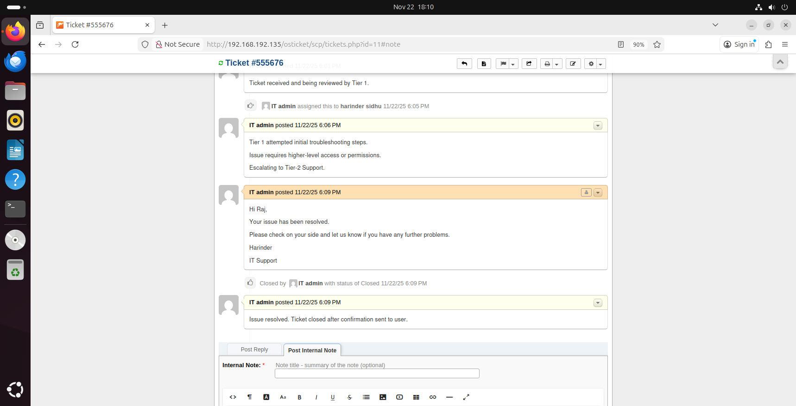

# 📘 IT Help Desk Ticketing System Project (osTicket)

A complete help desk workflow demonstration built using **osTicket** on **Ubuntu Server**.  
This project highlights my understanding of **ticketing systems**, **ticket lifecycle**,  
**agent workflow**, and **basic IT support procedures** used in real companies.

---

# 📂 Table of Contents
1. Project Overview  
2. System Architecture  
3. Environment Setup  
4. osTicket Installation  
5. Ticketing System Configuration  
6. Ticket Lifecycle Demonstration  
7. What I Learned  
8. Resume Summary  
9. Interview Talking Points  

---

# 📌 1. Project Overview

This project demonstrates my hands-on experience with:

- Setting up an osTicket environment  
- Managing departments, teams, roles, agents, and users  
- Understanding how tickets move in real help desk environments  
- Documenting internal notes, escalation, and resolution  
- Learning ticket lifecycle:  
  - **Creation → Assignment → Internal Notes → Escalation → Resolution → Closure**

This project is designed to build strong job-ready IT Support and Help Desk skills.

---

# 🏗️ 2. System Architecture

```
+-------------------------------+
| Ubuntu Server 22.04           |
|  - Apache Web Server          |
|  - PHP + Extensions           |
|  - MySQL Database             |
|  - osTicket Application       |
+-------------------------------+
             |
             |
+-------------------------------+
| osTicket Web Interface        |
| - User Portal                 |
| - Agent Panel                 |
+-------------------------------+
```

---

# 💻 3. Environment Setup

**VM Platform:** VMware Workstation  
**Server OS:** Ubuntu Server 22.04 LTS  
**Specs:**  
- 2 vCPU  
- 4 GB RAM  
- 35 GB Storage  

**Software Installed:** Apache, PHP, MySQL, osTicket

---

# 🛠️ 4. osTicket Installation

Installed osTicket manually by:

- Installing Apache, PHP, and modules  
- Installing MySQL  
- Creating osTicket database + user  
- Copying osTicket files to `/var/www/html/osticket`  
- Running the web installer  
- Creating admin account  
- Securing config and removing setup directory  
 
- **01 - Installer_Loaded.png**


---

# 🧩 5. Ticketing System Configuration

## ✔ Departments created:
- IT Support  
- Human Resources (HR) 
- Finance  
- Sales  
- Operations  

- **02 - Departments_Setup.png**


---

## ✔ Roles created:
### **Tier 1 Support**
- View tickets  
- Post replies  
- Assign / transfer  
- Use premade replies  

### **Tier 2 Support**
- All Tier 1 permissions  
- Edit tickets  
- Close tickets  
- Manage SLAs  
   
- **03 - Support_Role.png**


---

## ✔ Teams
- **Help Desk Team** (Tier 1)  
- **IT Support Team** (Tier 2)

---

## ✔ Agents
- **Harinder Sidhu** → Tier 2  
- **John Doe** → Tier 1  
  
- **04 - Agents_List.png**


---

## ✔ End Users (Employees)
- Simranjit Singh (HR)  
- Raj Patel (Finance)  
- Rick (Sales)

---

# 🎫 6. Ticket Lifecycle Demonstration

Below is the full lifecycle of a ticket, showing my understanding of how help desk systems work in real jobs.

---

## **1) Ticket Creation**

User opened a ticket from the user portal.

**Example:**  
"Password Reset Request"
 
- **05 - Ticket_Created.png**


# 🔐 ✔ Example Ticket Resolved: Password Reset

This example shows a simple and common help desk issue that almost every IT Support Technician handles: **account lockout + password reset**.

### 📝 Issue
User **Simranjit Singh** could not log in to their workstation.  
The system displayed an account lockout message.


---

### 🔧 Fix
I opened **Active Directory Users and Computers**, located the user inside the **Employees** OU, and performed a password reset to unlock the account.



This restored the user’s access immediately.

---

### 📩 Final Reply
A short confirmation was sent back to the user stating that their password was reset and they can now log in successfully.


---

## **2) Categorization & Assignment**

Ticket categorized under appropriate Help Topic and assigned to:

- **Help Desk Team (Tier 1)**

- **06 - Tickets_Created_&_Assigned.png**


---

## **3) Internal Notes (Technician Documentation)**

Tier 1 added an internal note:

```
Ticket recieved and being reviewed by Tier 1
```

- **07 - Internal_Note_Added.png**


---

## **4) Escalation to Tier 2**

Tier 1 escalated issue to:

- **Harinder Sidhu (Tier 2 Support)**  
- Status changed to **In Progress**
  
- **08 - Escalation.png**


---

## **5) Final Reply to User**

Tier 2 provided a professional user-facing reply:

```
Your issue has been resolved. 
Please check on your side and let us know if you have any further problems.
```

---

## **6) Ticket Closed**

Ticket marked as:

- **Resolved** or  
- **Closed**

- **09 - Final_Reply_&_Ticket_Closed.png**


---

# 🎯 7. What I Learned

From this project I gained real, practical understanding of:

- How ticketing systems work  
- How users submit requests  
- How agents categorize tickets  
- Adding internal notes and documenting work  
- Assigning tickets to agents or teams  
- Escalation process from Tier 1 → Tier 2  
- Communicating with users professionally  
- Closing tickets properly  

These are core skills for **Tier 1 IT Support, Service Desk, Help Desk** roles.

---

# 📄 8. Resume Summary

**osTicket Help Desk Ticketing System Project**  
- Built and configured osTicket on Ubuntu Server  
- Set up departments, teams, roles, agents, and users  
- Demonstrated full ticket lifecycle: creation, categorization, assignment, escalation, resolution  
- Documented internal notes and professional communication with users  
- Showcased understanding of real help desk workflows used in companies  

---

# 💬 9. Interview Talking Points

- “Yes, I’ve worked with osTicket in a full help desk lab.”  
- “I understand how the ticket lifecycle works from start to finish.”  
- “I know how to escalate tickets from Tier 1 to Tier 2.”  
- “I learned how to document internal notes and send professional replies.”  
- “I built departments, roles, teams, and agent permissions myself.”  
- “This project prepared me for real-world IT Support workflows.”

---

# 🎉 Project Completed Successfully

This project gives me real experience with help desk ticketing systems, ticket flows, documentation, and escalation — skills needed for my first IT job.
